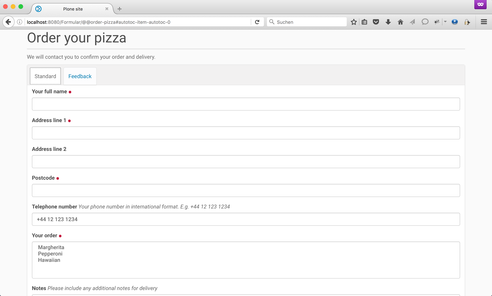
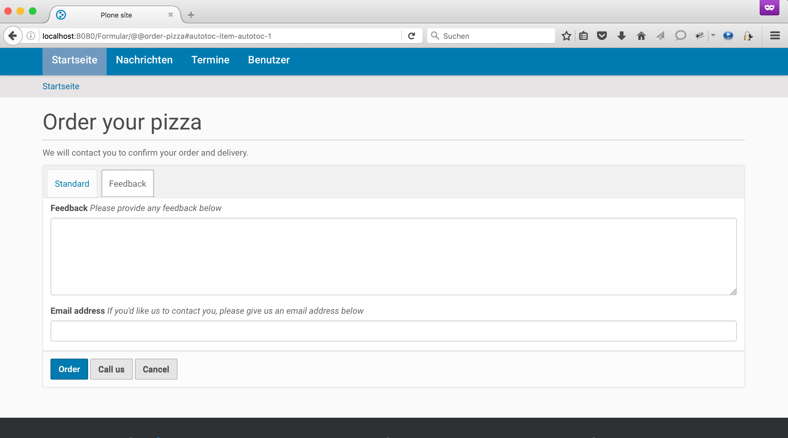

.. This README is meant for consumption by humans and pypi. Pypi can render rst files so please do not use Sphinx features.
   If you want to learn more about writing documentation, please check out: http://docs.plone.org/about/documentation_styleguide.html
   This text does not appear on pypi or github. It is a comment.

==============================================================================
example.form
==============================================================================

This package shows how to create a schema-driven form in Plone.
It follows the documentation at http://docs.plone.org/develop/addons/schema-driven-forms/

This form will have examples for a lot of functionality needed for forms.

- Creating a simple form
    - Creating a package
    - Creating a schema
    - Creating the form view
    - Testing the form

- Customising form behaviour

    - Validation
    - Vocabularies
    - Widgets
    - Actions (buttons)
    - Fieldsets

Features
--------

- Can be bullet points

Examples
--------

This add-on can be seen in action at the following sites:
- Is there a page on the internet where everybody can see the features?

Documentation
-------------

Full documentation for end users can be found in the "docs" folder, and is also
available online at http://docs.plone.org/develop/addons/schema-driven-forms/

Translations
------------

This product has not been translated into

- German

Installation
------------

Install example.form by adding it to your buildout::

    [buildout]

    ...

    eggs =
        example.form

and then running ``bin/buildout``

Contribute
----------

- Issue Tracker: https://github.com/staeff/example.form/issues
- Source Code: https://github.com/staeff/example.form
- Documentation: http://docs.plone.org/develop/addons/schema-driven-forms/

License
-------

The project is licensed under the GPLv2.
